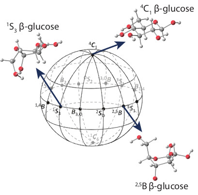

# Using multiscale modeling to discover protein-sugar interactions and harness them for renewable energy and improved health

Nature has evolved a wide range of proteins responsible for storing energy in 
carbohydrates, transporting them, and cleaving their bonds to release energy, 
each exquisitely tuned to the unique stereochemistry of different sugars. These 
sugars also modify protein structure and function through post-translational 
attachment carbohydrates to proteins, with varied effects based on glycan 
composition and binding location. The study of carbohydrate-protein interactions 
is industrially important for efforts to harness biotechnology to create renewable 
fuels and chemicals from non-food biomass. Applications of this research also include 
human health, as defects in carbohydrate-active enzymes and protein glycosylation are 
implicated in human diseases including cancer, muscular dystrophy, and autoimmune disorders.

My group uses computational tools to probe these interactions at a wide range of 
length and time scales to answer questions ranging from fundamental understanding 
to industrial feasibility. We employ computational chemistry tools including quantum 
mechanics (QM), molecular dynamics (MD), and rare-event sampling methods to uncover 
fundamental understandings of protein-carbohydrate structure-function relationships, 
opening opportunities for rational design of enzymes and diagnostic tools. Collaborating 
with experimental groups, we aim to understand past and guide future wet-lab studies to 
advance renewable chemicals and fuels as well as health.

Currently, these interests fuel the following projects:

# Computational Tools for Protein Design, Led by [Alex Adams](team#xadams) 

A challenge for utilizing biomass for renewable fuels and chemicals is achieving co-utilization of the 
primary constituent sugars: glucose and xylose. Typically, microorganisms selectively catabolize all 
available glucose before consuming xylose, leading to two distinct growth phases which complicate design 
of an economical continuous process. We aim to investigate the molecular basis of glucose inhibition of 
xylose transport into cells through multi-scale atomistic modeling. We will apply this understanding to 
rationally design improved protein transporters that advance biotechnology and future protein design.

# Size-based sorting of Exosomes, Led by [Emma Purcell](team#epurcell)

Exosomes are lipid bilayer membrane vesicles that are known to enhance tumor metastasis by stimulating both 
tumor growth and tumor cell migration. It is crucial to be able to sort exosomes out of blood to further 
elucidate their role in cancer. Current techniques for exosomal sorting in microfluidics are expensive and 
low throughput, using either antibody capture or other active techniques.  By designing a high throughput, 
size-based exclusion method for the separation of exosomes using inertial microfluidics, we aim to facilitate 
the further study of exosome biology.

# Conformational cartography: mapping and comparing ring conformational landscapes, Led by [Stephen Vicchio](team#svicchio) with assistance from [Sam Schwartz](team#sschwartz)

Researchers utilizing Quantum Mechanic/Molecular Mechanic (QM/MM) simulations are able to provide fundamental insight 
to crucial molecular phenomena, such as the cleavage of the cellulose glycosidic bonds during biofuel production. The 
QM method captures essential electronic distortions in the cellulose structure initiated by the enzyme, which provides 
fundamental knowledge about the mechanism that is experimentally elusive. However, the expensive of QM is often a 
limiting factor in the amount of conformational sampling that is feasible. We are investigating the role of the 
computational method used in the the results found through simulations of key phenomena.  

# What if? Computational investigations of enzyme mutants to learn from nature's design strategies, Led by [Tucker Burgin](team#tburgin)

The group works towards understanding the processive mechanism of a mutant glycoside hydrolase enzyme through molecular 
dynamics simulations and related computational techniques, in collaboration with structural biologists. Future work 
will continue to uncovering the mechanisms of other mutant enzymes that catalyze entirely different reactions from 
their wild-type counterparts. The ultimate research goal is to elucidate the molecular foundations underlying the b
ehavioral changes imparted to enzymes by mutations in a generalizable way, to aid rational enzyme design.