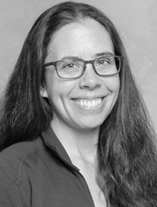
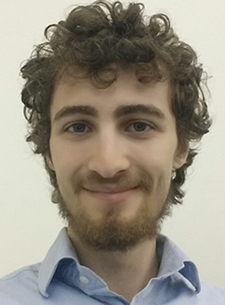
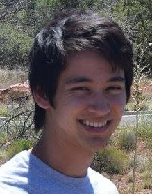
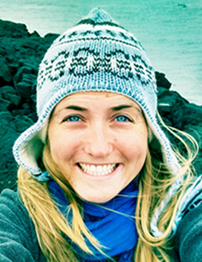
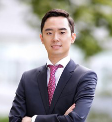
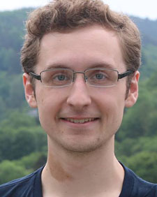
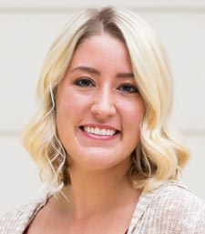
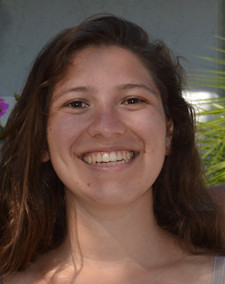

# Principal Investigator

## Heather B. Mayes

Heather studied humanities at Harvard University before realizing that she is a chemical engineer. She
received her BS in Chemical Engineering from the University of Illinois at Chicago. 
She then worked for three years as a chemical engineering consultant on projects 
including new technology development, process safety, and meeting new EPA standards. 
To deepen her knowledge, she returned to school and received her PhD in chemical 
engineering from Northwestern University in the summer of 2015. 
[Dr. Linda J. Broadbelt](http://www.mccormick.northwestern.edu/research-faculty/directory/profiles/broadbelt-linda.html)
at Northwestern advised her and [Dr. Gregg T. Beckham](http://www.nrel.gov/bioenergy/bios/gregg-beckham.html) 
of the National Renewable Energy 
Laboratory co-advised her as she employed computational chemical engineering to uncover 
the molecular mechanisms that underlie thermal and enzymatic cellulose decomposition 
toward advancing technologies that will produce sustainable chemicals and fuels. 
She was a Department of Energy Computational Science Graduate Fellow and earned 
the AIChE Computational Molecular Science and Engineering Forum Graduate Student 
Award and ACS Chemical Computing Group Research Excellence Award. She deferred begining her position at the 
University of Michigan for a short postdoctoral scholar position at the University of Chicago, where she developed a multiscale kinetic modeling approach to capture the stochastic nature of coupled ion transport in a transmembrane antiporter. At the University of Michigan, 
she works to elucidate protein-carbohydrate interactions for applications in renewable energy and glycobiology.

# Graduate Students

##  Tucker Burgin

Tucker earned his BS and MS in Biomedical Engineering (with a concentration in Chemical Engineering) through a combined degree 
program at the [University of Rochester](https://enrollment.rochester.edu/professional/gear/). He conducted research with the 
[Nanomembranes Research Group](http://nanomembranes.org/) and the [McGrath Lab](https://www.urmc.rochester.edu/labs/McGrath-Lab/), 
and his MS thesis work centered on building models to support the application of ultra-thin silicon membranes to highly efficient, 
wearable hemodialysis devices.

##  Alexander Adams

Alex earned his BS in Chemical Engineering from the [University of Florida](http://www.che.ufl.edu/). He worked at [Harris
Corporation](https://www.harris.com/) on signal filtering through photonic communication links and at Honeywell on process 
automation for nylon. He also participated in the [Scientific Undergraduate Laboratory Internship (SULI)](http://science.energy.gov/wdts/suli/) 
program at [Oak Ridge National Lab](https://www.ornl.gov/) where he worked on high performance Li-ion battery anodes 
produced from recycled rubber tire waste. Alex is co-advised by [Dr. Sharon Glotzer](http://glotzerlab.engin.umich.edu/home/).

##  Emma Purcell

Emma earned her BS in Chemical Engineering from the [University of California San Diego](http://nanoengineering.ucsd.edu).  
She completed an REU through the Colorado Centre for Biofuels and Biorefining in [Matthew Posewitz’s lab](http://algae.mines.edu/) at the 
Colorado School of Mines.  While in the Posewitz lab, she worked on the metabolic engineering of cyanobacteria for biofuels applications.  
After finishing her BS, she traveled to New Zealand and worked at the University of Canterbury in 
[Renwick Dobson’s lab](http://www.bic.canterbury.ac.nz/people/investigator/dobson.shtml) 
on the development and design of microfluidic chips for artificial lipid bilayer formation. 
Emma is co-advised by [Dr. Sunitha Nagrath](http://cheresearch.engin.umich.edu/nagrath/index.html).

##  Youngwoo Woo

Youngwoo earned his BS in Materials Science and Engineering from Seoul National University before joining
the Department of Materials Science and Engineering at the University of Michigan to pursue a Master's degree. He joined the Mayes group to pursue his 
interest in in data science within chemical engineering, and is exploring how glycosylation affects protein physical properties.

# Undergraduate Students

##  Justin Huber

Justin Huber is a rising senior at the University of Michigan. He is currently pursuing a Bachelor's in
Chemical Engineering and a minor in Computer Science. In 2016, he participated in an
undergraduate research program in Aachen, Germany exploring various optimization methods in
modelling an extraction column for pre-screening solvents for use in biofuels. Currently, Justin is
working to model conformational pathways in ring-opening reactions of sugars important for health and renewable energy.

##  Carly Prast

Carly Prast is a senior at the University of Michigan studying Chemical Engineering. 
She is originally from Rochester, Michigan. Currently, Carly is using COMSOL Multiphysics 
to simulate microfluidic focusing of exosomes for cancer diagnostics. 

 

 

##  Jason Fannin

Jason joined Team Mayes &amp; Blue shortly after transfering to the University of Michigan from Washtenaw Community College. He is working with Alex Adams on modeling sugar transport into cells. 

 

 

##  Samantha Schwartz

Samantha is a rising undergraduate Senior at the University of Michigan, majoring in Chemical Engineering and minoring in Computer science. 
She is originally from Fairfield, Connecticut and is currently performing QM simulations of monosaccharide 
reactions, determining how to best model the conformational changes during the reactions. 

 

<!-- ##  Samantha Schwartz

Sam was the first undergraduate to join Team Mayes &amp; Blue, as a second-semester junior at the University of Michigan, majoring in Chemical Engineering and minoring in Computer science. She performed QM simulations of monosaccharide reactions, determining how to best model the conformational changes during the reactions. 

 -->

# Previous Undergraduate Students

##  Rohith Pentaparthy

Rohith worked in our group in the summer of 2017, when he was a rising Senior undergraduate student at the University of Michigan, majoring in Data Science and 
minoring in Biochemistry. He is originally from Okemos, Michigan and worked on modeling modifications of sugar 
transport proteins in an effort to improve conversion efficiency.

# Previous Master's Students

##  Stephen Vicchio

Stephen was the first member of Team Mayes &amp; Blue, joining before Prof. Mayes started at Michigan. During his time in the group he worked on determining how different computational methods differently map carbohydrate potential energy surfaces.
