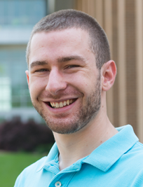

# Principal Investigator

## Heather B. Mayes

Heather studied humanities at Harvard University before realizing that she is a chemical engineer. She
received her BS in Chemical Engineering from the University of Illinois at Chicago. 
She then worked for three years as a chemical engineering consultant on projects 
including new technology development, process safety, and meeting new EPA standards. 
To deepen her knowledge, she returned to school and received her PhD in chemical 
engineering from Northwestern University in the summer of 2015. 
[Dr. Linda J. Broadbelt](http://www.mccormick.northwestern.edu/research-faculty/directory/profiles/broadbelt-linda.html)
at Northwestern advised her and [Dr. Gregg T. Beckham](http://www.nrel.gov/bioenergy/bios/gregg-beckham.html) 
of the National Renewable Energy 
Laboratory co-advised her as she employed computational chemical engineering to uncover 
the molecular mechanisms that underlie thermal and enzymatic cellulose decomposition 
toward advancing technologies that will produce sustainable chemicals and fuels. 
She was a Department of Energy Computational Science Graduate Fellow and earned 
the AIChE Computational Molecular Science and Engineering Forum Graduate Student 
Award and ACS Chemical Computing Group Research Excellence Award. She is currently a 
postdoctoral scholar in the Voth Group at the University of Chicago, where she is 
modeling proton transport in transmembrane proteins. At the University of Michigan, 
she will elucidate protein-sugar interactions for applications in renewable energy and glycobiology.

# Graduate Students

##  Stephen Vicchio

Stephen earned his BS in Chemical Engineering from the University of 
Maryland, Baltimore County (UMBC) in Spring 2015, and joined the PhD 
program in Chemical Engineering at the University of Michigan in Fall 2015.
His undergraduate research experiences include: improving anode materials for Lithium-Ion batteries 
(during a [FREEDM Systems Center](https://www.freedm.ncsu.edu) REU at NC State University); 
performing longevity studies for Zinc-Calcium-Magnesium bulk metallic glasses degradable implants 
(part of a [Leadership Alliance SURF at Yale University](http://gsas.yale.edu/diversity/programs/summer-undergraduate-research-fellowship-surf)); and simulating Janus 
particles patterned with varying hydrophobicity at a water vapor-liquid 
interface (part of a [LSAMP REU at Rensselaer Polytechnic Institute](http://gradoffice.rpi.edu/update.do?catcenterkey=34)). As a member 
of Team Mayes and Blue, Stephen’s research focuses on creating a glycan
designer library elucidating trends on how specific glycosylation 
motifs impact protein function. The new, fundamental knowledge 
developed by Stephen’s work will better enable researchers to use glycosylation
as a tool to customize protein function.

##  Alexander Adams

Alex earned his BS in Chemical Engineering from the [University of Florida](http://www.che.ufl.edu/). He worked at [Harris
Corporation](https://www.harris.com/) on signal filtering through photonic communication links and at Honeywell on process 
automation for nylon. He also participated in the [Scientific Undergraduate Laboratory Internship (SULI)](http://science.energy.gov/wdts/suli/) 
program at [Oak Ridge National Lab](https://www.ornl.gov/) where he worked on high performance Li-ion battery anodes 
produced from recycled rubber tire waste. Alex is co-advised by [Dr. Sharon Glotzer](http://glotzerlab.engin.umich.edu/home/).

##  Tucker Burgin

Tucker earned his BS and MS in Biomedical Engineering (with a concentration in Chemical Engineering) through a combined degree 
program at the [University of Rochester](https://enrollment.rochester.edu/professional/gear/). He conducted research with the 
[Nanomembranes Research Group](http://nanomembranes.org/) and the [McGrath Lab](https://www.urmc.rochester.edu/labs/McGrath-Lab/), 
and his MS thesis work centered on building models to support the application of ultra-thin silicon membranes to highly efficient, 
wearable hemodialysis devices.

##  Emma Purcell

Emma earned her BS in Chemical Engineering from the [University of California San Diego](http://nanoengineering.ucsd.edu).  
She completed an REU through the Colorado Centre for Biofuels and Biorefining in [Matthew Posewitz’s lab](Matthew Posewitz) at the 
Colorado School of Mines.  While in the Posewitz lab, she worked on the metabolic engineering of cyanobacteria for biofuels applications.  
After finishing her BS, she traveled to New Zealand and worked at the University of Canterbury in [Renwick Dobson’s lab](http://www.bic.canterbury.ac.nz/people/investigator/dobson.shtml) 
on the development and design of microfluidic chips for artificial lipid bilayer formation. Emma is co-advised by [Dr. Sunitha Nagrath](http://cheresearch.engin.umich.edu/nagrath/index.html).