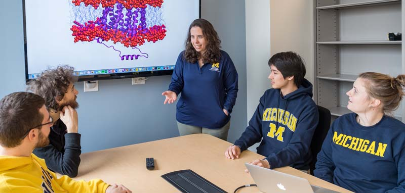

  Welcome to the website for Team Mayes and Blue! We are a computational group in 
  the [Chemical Engineering Department](http://www.engin.umich.edu/che) 
  at the [University of Michigan](https://www.umich.edu) (Go Blue!). We focus on discovering 
  fundamental structure-function relationships that govern how proteins 
  and sugars interact in application from renewable materials to human 
  health.
  
  Read more about our [research](research), [publications](publications), see our 
  [team members](team), or [contact us](contact). 
  
# News

## 2017 November

[Watch a video](https://www.youtube.com/watch?v=ZPG3gNTnca0) featuring our research initiatives, and the wonderful Ann Arbor Nichols Arboretum! 

## 2017 October

Congratulations to [Tucker Burgin](team#tburgin) on earning an outstanding poster award at the [Midwest Enzyme Chemistry Conference](http://www.midwestenzyme.org/)!

## 2017 September

The team welcomes [Carly Prast](team#cprast), a ChemE senior!

## 2017 June

The team welcomes [Rohith Pentaparthy](team#rpenta), a rising undergraduate senior studying data science and biochemistry!

## 2017 May

Congratulations to [Alex Adams](team#xadams), [Tucker Burgin](team#tburgin), and [Emma Purcell](team#epurcell), who 
all passed their Doctoral Candidacy Exams!

## 2017 March

The team welcomes [Justin Huber](team#jhuber)!

## 2017 January

The team welcomes [Sam Schwartz](team#sschwartz)!

## 2016 October

The team welcomes three new members, [Alex Adams](team#xadams), [Tucker Burgin](team#tburgin), and [Emma Purcell](team#epurcell)!

## 2016 August

The team welcomes our first member, [Stephen Vicchio](team#svicchio)!
  

